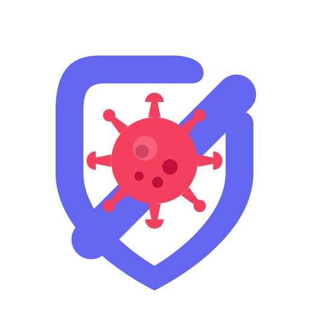

# 🛡️ Not To Do — Academic Routine & Habit Protection Vault

<p align="center">
  
</p>

<p align="center">
  <strong>An offline-first student productivity app powered by Gemini Vision to transform physical timetable photos into structured calendar blocks, featuring a 1-tap "Fix My Day" engine and an anti-habit protection vault.</strong>
</p>

<p align="center">
  <a href="LICENSE"></a>
  
  
  
  
  
  
</p>

---

## 📖 Overview

Traditional routine planners fail students when real life happens: classes get delayed, unexpected gaps appear, and bad habits siphon off study hours. **Not To Do** is engineered around defensive productivity:

1. **Photograph Your Timetable:** Ingest printed or handwritten syllabi directly using **Gemini Multimodal Vision**.
2. **Protect Against Distractions:** Invert traditional habit tracking by guarding against high-risk procrastination triggers (Not-To-Do items).
3. **1-Tap Dynamic Recovery:** When a study block is missed, the **"Fix My Day"** algorithmic engine re-balances flexible routines into verified idle time gaps while locking fixed academic lectures in place.
4. **Zero-Cloud Privacy (BYOK):** Completely offline-first with Hive local database and a Bring-Your-Own-Key (BYOK) architecture. Your schedule and credentials never pass through an intermediary backend.

---

## ✨ Key Features

### 📷 Multimodal Timetable Scanner
- Snap a photo or select an image of your course schedule, syllabus, or lecture board.
- On-device downsampling pipeline (`instantiateImageCodec`, `<= 1560px`) keeps peak memory `< 30MB`, preventing Android Low-Memory-Killer (LMK) eviction on high-resolution cameras.
- Gemini 1.5 Flash extracts course names, room numbers, instructor details, day of week, and precise time blocks into clean, structured staging records.
- Staging review drawer allows one-tap editing before committing events into your permanent timetable.

### ⚡ 1-Tap "Fix My Day" Rescheduling Engine
- Algorithmic idle gap finder (`ScheduleGapService`) scans the daily timeline to detect unscheduled gaps between academic lectures.
- Priority-guided reallocation: fixed events (lectures, labs, exams) remain immovable, while delayed focus sessions and personal routines are intelligently slotted into free gaps.
- Atomic state updates via Riverpod ensure frictionless timeline recalculations.

### 🛡️ Habit Protection Vault & "Not-To-Do" Triggers
- Identify and neutralize academic pitfalls: social media binges, late-night cramming, or missed revision cycles.
- Track defense streaks, log resisted temptations, and configure proactive shield alarms before habitual trigger windows.

### 🔄 Bi-Directional Device Calendar Sync
- Real-time synchronization with native device calendars (Google Calendar, Outlook, Apple Calendar) via `device_calendar`.
- **Offline Mutation Queue:** Calendar actions performed offline are securely enqueued in local storage and reconciled automatically when connectivity is restored.
- Graceful 401 token refresh handling and conflict avoidance.

### 🔔 Hardware-Reliable Background Notifications
- Configured with `SCHEDULE_EXACT_ALARM` and Android `exactAllowWhileIdle` for precise time trigger delivery even in deep Doze mode.
- Defensive fallback to `inexactAllowWhileIdle` on restrictive OEM operating systems (such as MagicOS / EMUI) to guarantee zero crash rates.
- Boot survival via `RECEIVE_BOOT_COMPLETED` broadcast receivers to restore routine alarms across device restarts.

### 🔒 Strict BYOK (Bring Your Own Key) Security
- Zero proprietary server middleware: API requests connect straight from client to `generativelanguage.googleapis.com`.
- Stored locally via `flutter_secure_storage` (Android Keystore / iOS Keychain) with encrypted Hive memory fallback.
- In-app key settings dialog with instant validation, input sanitization, and immediate key clearing.

---

## 🏗️ Architecture & Tech Stack

```
lib/
├── core/
│   ├── models/            # Hive-annotated TypeAdapters (AcademicEvent, HabitItem, TimelineBlock)
│   ├── providers/         # Riverpod providers & StateNotifiers (TimelineNotifier, HabitNotifier)
│   ├── repositories/      # Local Hive storage repositories
│   ├── services/          # Gemini AI services, CalendarSync, ScheduleGap, NotificationService
│   ├── theme/             # Modern high-contrast academic UI design system & AppColors
│   └── widgets/           # Global widgets (API settings dialog, AppBootstrapWidget, Logo, Header)
├── features/
│   ├── habits/            # Habit Vault UI, Add Habit Sheet, Defense tracking
│   ├── navigation/        # Bottom navigation scaffold & screen routing
│   ├── sync_ai_guard/     # Calendar sync modal, collision detection, queue status
│   ├── timetable/         # Timetable grid, multimodal image import modal, staging sheet
│   └── today/             # Daily timeline view, dynamic cards, "Fix My Day" bottom sheet
└── main.dart              # Zero-blocking bootstrap entrypoint & global error boundaries
```

### Technology Highlights
- **Framework:** [Flutter](https://flutter.dev/) (Channel stable, Dart >= 3.0.0 < 4.0.0)
- **State Management:** [Flutter Riverpod](https://pub.dev/packages/flutter_riverpod)
- **Persistence:** [Hive](https://pub.dev/packages/hive) & [Hive Flutter](https://pub.dev/packages/hive_flutter)
- **Multimodal AI:** [google_generative_ai](https://pub.dev/packages/google_generative_ai) (Gemini 1.5 Flash / Pro)
- **Keystore / Keychain:** [flutter_secure_storage](https://pub.dev/packages/flutter_secure_storage)
- **Calendar:** [device_calendar](https://pub.dev/packages/device_calendar)
- **System Alarms:** [flutter_local_notifications](https://pub.dev/packages/flutter_local_notifications), [timezone](https://pub.dev/packages/timezone)

---

## 🚀 Getting Started

### Prerequisites
- [Flutter SDK](https://docs.flutter.dev/get-started/install) (3.10.0 or higher)
- [Dart SDK](https://dart.dev/get-dart) (>= 3.0.0)
- Android Studio / VS Code with Flutter extension
- An active [Google AI Studio API Key](https://aistudio.google.com/) for Gemini Vision & AI features

### Installation

1. **Clone the repository:**
   ```bash
   git clone https://github.com/asnayem1122/Not_to_Do.git
   cd Not_to_Do
   ```

2. **Install dependencies:**
   ```bash
   flutter pub get
   ```

3. **Run Code Generation (if modifying Hive adapters):**
   ```bash
   dart run build_runner build --delete-conflicting-outputs
   ```

4. **Run the Application:**
   ```bash
   flutter run
   ```

   *Optional: You can supply a default Gemini API Key at compile-time:*
   ```bash
   flutter run --dart-define=GEMINI_API_KEY="your_api_key_here"
   ```
   *(Alternatively, tap the Settings icon in the app header to paste your API key at runtime).*

---

## 🧪 Running Tests

The test suite covers algorithmic gap rescheduling, offline sync queue reconciliation, image downsampling safeguards, and widget smoke tests:

```bash
flutter test
```

Expected output:
```
00:00 +17: All tests passed!
```

---

## 🔐 Security & Privacy Policy

- **No Remote Telemetry:** The app does not transmit user timetable data, habits, or routines to any third-party logging server.
- **Direct Gemini Ingestion:** When scanning timetables, images are processed directly between the device and Google's official Gemini endpoint.
- **Local Secret Isolation:** Gemini API keys are never written to unencrypted shared preferences and are excluded from all version control files.

---

## 📄 License

This project is licensed under the **Apache License 2.0**. See the [LICENSE](LICENSE) file for details.
