# Not To Do — Master System Architecture & Project Vision

> **Comprehensive Technical Specification and Architecture Blueprint**  
> *Target Audience: Human Developers, System Architects, and Autonomous AI Coding Agents.*  
> **Mandatory Maintenance Rule**: Whenever code changes, new features are implemented, or dependencies are adjusted, **ALWAYS update this `document.md` and verify `.gitignore` before committing or pushing.**

---

## Table of Contents
1. [Project Vision & Core Philosophy](#1-project-vision--core-philosophy)
2. [High-Level Architecture & Tech Stack](#2-high-level-architecture--tech-stack)
3. [Repository Directory Map](#3-repository-directory-map)
4. [Data Models & Hive Persistence Schema](#4-data-models--hive-persistence-schema)
5. [Core Services & Algorithmic Engines](#5-core-services--algorithmic-engines)
6. [Presentation Layer & UI Features](#6-presentation-layer--ui-features)
7. [Android Production Hardening & OEM Resilience](#7-android-production-hardening--oem-resilience)
8. [Launcher Icon & Brand System](#8-launcher-icon--brand-system)
9. [Development, Testing & Release Workflows](#9-development-testing--release-workflows)
10. [Golden Rules for Future AI & Human Contributors](#10-golden-rules-for-future-ai--human-contributors)

---

## 1. Project Vision & Core Philosophy

### The "Not To Do" Paradigm
Standard to-do list applications fail university students and knowledge workers because they encourage endless backlog expansion without accounting for fixed physical reality (class schedules, lab sessional blocks, commute times, biological energy dips). When unallocated hours appear between university classes, students succumb to high-dopamine distraction traps (social media scrolling, gaming, binge-watching), sabotaging their study momentum.

**Not To Do** flips this paradigm by acting as an **Academic Anti-Habit Defense & Schedule Optimization Engine**:
1. **Immovable Academic Spine**: University lectures, laboratory sessions, midterms, and verified device calendar appointments are treated as locked, non-negotiable anchor events.
2. **Automated Free-Slot Discovery**: The engine calculates non-overlapping idle intervals between classes within a student's waking window (07:30 to 22:30).
3. **Proactive Anti-Habit Shields**: Instead of just suggesting "Study", the app carves out explicit **"Not To Do" Distraction Shields** (e.g. locking out Instagram, Steam, TikTok, YouTube Shorts during vulnerable post-lunch energy dips).
4. **Conversational Memory Agent (Gemini AI)**: A multi-turn AI negotiation layer that fine-tunes daily routines, accepts custom student prompts ("Exam Prep Mode", "Heavy Lab Week"), and deploys positive habits and anti-habit barriers.
5. **Multimodal Syllabus Scanner**: Instant timetable ingestion from photos of physical paper routines, noticeboards, whiteboard schedules, or PDF tables via Gemini Vision.
6. **1-Tap Emergency Schedule Repair ("Fix My Day")**: When students wake up late or classes overrun, a single tap dynamically shifts pending routine blocks forward into remaining free gaps without disturbing locked academic events or surpassing bedtime curfew (22:30).

---

## 2. High-Level Architecture & Tech Stack

```mermaid
flowchart TD
    subgraph UI ["Presentation Layer (Flutter 3.x / Material 3)"]
        Hub["StudentLifeOsScreen\n(Hub Dashboard)"]
        Today["TodayTimelineScreen\n(Today)"]
        Timetable["ClassTimetableScreen\n(Routine)"]
        Habits["HabitProtectionScreen\n(Not To Do)"]
        SyncModal["SyncAiGuardModal\n(AI Guard Tab)"]
        FixSheet["FixMyDaySheet\n(Emergency 1-Tap)"]
        VisionImport["RoutineImportModal\n(Multimodal Scanner)"]
    end

    subgraph State ["Reactive State Management (Riverpod 2.x)"]
        TimelineProvider["timelineBlocksProvider"]
        AcademicProvider["academicEventsProvider"]
        HabitsProvider["habitsProvider"]
        SyncSettingsProvider["syncSettingsProvider"]
        ApiKeyProvider["geminiApiKeyProvider"]
        GapsProvider["todayFreeGapsProvider"]
    end

    subgraph Services ["Domain Services & AI Engines"]
        GapService["ScheduleGapService\n(Gap Detection Engine)"]
        RescheduleService["EmergencyRescheduleService\n(Deterministic Schedule Repair)"]
        AiAgent["AiConversationalAgentService\n(Multi-Turn Memory Agent)"]
        VisionParser["RoutineParserService\n(Gemini Multimodal Parser)"]
        CalSync["CalendarSyncService\n(2-Way Device Calendar)"]
        NotifService["NotificationService\n(Exact Alarms & Background Alerts)"]
        KeyService["ApiKeyService\n(Dual-Layer Sanitized Vault)"]
    end

    subgraph Storage ["Persistence Layer"]
        HiveAcademic["Hive: academic_events_box"]
        HiveHabits["Hive: habits_box"]
        HiveTimeline["Hive: timeline_blocks_box"]
        HiveSettings["Hive: settings_box"]
        SecureStorage["FlutterSecureStorage\n(Encrypted Mirror)"]
    end

    UI --> State
    State --> Services
    Services --> Storage
```



### Technology Stack
- **Framework**: Flutter (Channel stable, 3.29.x / 3.47.x) & Dart 3.x.
- **State Management**: `flutter_riverpod: ^2.5.1`.
- **Local Persistence**: `hive: ^2.2.3` & `hive_flutter: ^1.1.0` (Offline-first disk storage).
- **Artificial Intelligence**: `google_generative_ai: ^0.4.6` (Gemini 3.6 Flash primary with automatic 3.8 Flash fallback — centralized in `GeminiConstants`).
- **Native Synchronization**: `device_calendar: ^4.3.2` (Bidirectional sync with Google Calendar / device calendar).
- **Push Alerts & Exact Alarms**: `flutter_local_notifications: ^17.2.2`, `timezone: ^0.9.4`, `permission_handler: ^11.3.1`.
- **Media Ingestion**: `image_picker: ^1.1.2`, `file_picker: ^8.0.0`.
- **Typography**: `google_fonts` — a single family (Plus Jakarta Sans) carries the entire UI.
- **UI Tokens**: Material 3 design system with custom Stitch semantic tokens; the brand mark is a pure-Flutter custom painter (no SVG dependency as of v1.1).

---

## 3. Repository Directory Map

```text
d:\Code\Not_to_do\
├── android/                          # Android native project configuration
│   ├── app/
│   │   ├── src/main/
│   │   │   ├── AndroidManifest.xml   # Permissions (Exact Alarm, Calendar, Boot, Camera)
│   │   │   └── res/
│   │   │       ├── drawable/         # Launch background splash drawables
│   │   │       ├── mipmap-*/         # Clean transparent app launcher icons (all densities)
│   │   │       ├── mipmap-anydpi-v26/# Adaptive icon definitions (transparent background)
│   │   │       └── values/colors.xml # #00000000 transparent icon background token
│   │   ├── build.gradle.kts          # Gradle build script with ProGuard / R8 rules
│   │   └── proguard-rules.pro        # Production shrinking and obfuscation rules
├── assets/
│   └── stitch/                       # Semantic Stitch design assets, specs, and logos
│       ├── 01_design_system.md       # Stitch UI tokens & typographic scale
│       ├── 06_logo_transparent.png   # Authentic 512x512 transparent logo mark
│       ├── 06_logo_transparent.svg   # Vector logo master
│       ├── 07_student_life_os.png    # Hub dashboard Stitch design reference
│       ├── 08_shield_slash_logo.png  # Brand mark export
│       ├── course_syllabus_drilldown.html # Stitch-generated syllabus workstation
│       ├── course_syllabus_drilldown.png  # Stitch syllabus workstation screenshot
│       ├── pixel_greenery_banner.png # Botanical pixel-art hub banner
│       ├── course_*.jpg              # Course card thumbnails (CS, OOP, Algorithm, Software, DS)
│       └── hub_*.jpg                 # Hub gateway thumbnails (assignments, exams, notes, resources)
├── lib/
│   ├── main.dart                     # Zero-ANR entry point (<100ms first-frame render)
│   ├── core/
│   │   ├── constants/
│   │   │   └── gemini_constants.dart # Centralized active Gemini model definitions (gemini-3.6-flash)
│   │   ├── models/                   # Hive-annotated domain data models
│   │   │   ├── routine_models.dart   # AcademicEvent, HabitItem, TimelineBlock, SyncSettings
│   │   │   └── routine_models.g.dart # Generated Hive TypeAdapters
│   │   ├── providers/
│   │   │   └── routine_providers.dart# Riverpod StateNotifiers & computed gap providers
│   │   ├── repositories/
│   │   │   └── routine_repository.dart# HiveRoutineRepository with corruption self-healing
│   │   ├── services/
│   │   │   ├── api_key_service.dart  # Dual-layer persistent & auto-sanitizing API key manager
│   │   │   ├── ai_planner_service.dart# Gemini routine gap plan generator
│   │   │   ├── ai_conversational_agent_service.dart # Multi-turn memory agent
│   │   │   ├── calendar_sync_service.dart # 2-way native device calendar synchronizer
│   │   │   ├── emergency_reschedule_service.dart # 1-tap "Fix My Day" schedule repair engine
│   │   │   ├── notification_service.dart # Exact-alarm notification scheduler with fallback
│   │   │   ├── routine_parser_service.dart # Gemini Vision multimodal syllabus/routine parser
│   │   │   └── schedule_gap_service.dart # Deterministic chronological free-slot detection
│   │   ├── theme/
│   │   │   ├── app_colors.dart       # Stitch design color tokens (Light / Dark)
│   │   │   └── app_theme.dart        # Material 3 ThemeData + unified Plus Jakarta Sans typography, motion & component polish
│   │   └── widgets/
│   │       ├── api_settings_dialog.dart # BYOK configuration modal with 1-tap clipboard paste
│   │       ├── app_bootstrap_widget.dart# Branded first-frame zero-ANR startup gate
│   │       ├── app_logo.dart         # Authentic original brand mark with vector fallback
│   │       └── app_top_header.dart   # Unified app header with live sync and Gemini status
│   └── features/
│       ├── dashboard/
│       │   └── presentation/
│       │       ├── student_life_os_screen.dart # Student Life OS hub dashboard (command center)
│       │       ├── course_syllabus_drilldown_screen.dart # Interactive course workstation & syllabus drilldown
│       │       └── widgets/
│       │           ├── analog_clock_widget.dart   # Live analog + digital chronometer painter
│       │           ├── pomodoro_timer_widget.dart # 25-minute focus station with break cycles
│       │           └── wheel_of_life_chart.dart   # 6-axis life-balance radar chart
│       ├── navigation/
│       │   └── main_scaffold.dart    # Student-hub bottom navigation (Hub, Today, Routine, Not To Do, AI Guard)
│       ├── today/
│       │   ├── presentation/
│       │   │   ├── today_timeline_screen.dart # Interactive timeline with progress & actions
│       │   │   └── widgets/
│       │   │       └── fix_my_day_sheet.dart  # Emergency schedule repair bottom sheet
│       ├── timetable/
│       │   └── presentation/
│       │       ├── class_timetable_screen.dart # Weekly class matrix with day tabs
│       │       └── widgets/
│       │           ├── routine_import_modal.dart # Multimodal camera/file syllabus scanner
│       │           └── staging_review_sheet.dart # Staging verification for imported classes
│       ├── habits/
│       │   └── presentation/
│       │       ├── habit_protection_screen.dart   # Habit tracker & "Not To Do" barrier cards
│       │       └── widgets/
│       │           └── add_habit_sheet.dart       # Positive habit / anti-habit barrier editor sheet
│       └── sync_ai_guard/
│           └── presentation/
│               └── sync_ai_guard_modal.dart  # Conversational routine negotiation sheet
├── test/                             # Automated test suite (21 Unit & Widget tests)
│   ├── api_key_service_test.dart
│   ├── emergency_reschedule_service_test.dart
│   ├── offline_sync_and_image_test.dart
│   ├── routine_parser_service_test.dart
│   ├── schedule_gap_service_test.dart
│   ├── timeline_notifier_test.dart
│   └── widget_test.dart
├── .env.example                      # Commit-safe template for the optional git-ignored dev .env fallback
├── .gitignore                        # Strict build, artifact, key, and cache exclusion rules
├── document.md                       # THIS DOCUMENT (Master architecture & project vision)
└── pubspec.yaml                      # Dependencies, assets, and project metadata
```

---

## 4. Data Models & Hive Persistence Schema

The app is offline-first. All data is written to local Hive binary storage files. Type IDs are strictly assigned:

### 1. `AcademicEvent` (Hive TypeId: 1)
Represents a locked university class, laboratory session, quiz, or milestone:
- `id` (String): Unique identifier.
- `courseCode` (String): e.g. "CSE 3101", "MATH 2205".
- `title` (String): e.g. "Database Systems", "Software Engineering Lab".
- `instructor` (String): Teacher initials or full name.
- `room` (String): Classroom or laboratory location.
- `dayOfWeek` (int): 1=Mon, 2=Tue, 3=Wed, 4=Thu, 5=Fri, 6=Sat, 7=Sun.
- `startTime` (String): 24-hour time format `"HH:mm"`.
- `endTime` (String): 24-hour time format `"HH:mm"`.
- `type` (`AcademicEventType` enum, TypeId: 2): `lecture`, `sessionalLab`, `tutorial`, `classTest`, `assignment`, `midterm`, `termFinal`.
- `syllabusNotes` (String?): Key study goals or lab milestones.
- `syncedCalendarEventId` (String?): Corresponding Google Calendar native event ID.

### 2. `HabitItem` (Hive TypeId: 3)
Tracks daily positive study rituals and "Not To Do" distraction lockouts:
- `id` (String): Unique identifier.
- `title` (String): Habit name.
- `category` (String): e.g. "Academic", "Distraction", "Health".
- `streakCount` (int): Consecutive days completed or barrier maintained.
- `isAntiHabit` (bool): `true` if this represents a prohibited behavior to shield against.
- `shieldRuleDescription` (String?): Specific behavioral constraint (e.g. "No Instagram or TikTok before 17:00").
- `replacementTrigger` (String?): Positive substitute action when impulse strikes (e.g. "Drink 200ml water and do 5 deep breaths").
- `lastCompletedDate` (DateTime?): Timestamp of last recorded streak update.

### 3. `TimelineBlock` (Hive TypeId: 4)
Represents scheduled time chunks in today's active routine:
- `id` (String): Unique identifier.
- `title` (String): Block title.
- `startTime` (String): `"HH:mm"`.
- `endTime` (String): `"HH:mm"`.
- `type` (`TimelineBlockType` enum, TypeId: 5):
  - `academicClass`: Immovable university lecture or lab.
  - `routineFocus`: Dedicated study or habit block.
  - `antiHabitShield`: Proactive distraction barrier lockout block.
  - `calendarSync`: External appointment imported from device Google Calendar.
- `referenceId` (String?): Foreign key linking to `AcademicEvent` or `HabitItem`.
- `subtitle` (String?): Contextual rationale or blacklisted apps.
- `location` (String?): Room number or study location.
- `isCompleted` (bool): User completion check.
- `badgeText` (String?): Priority badge (e.g. "SHIELD", "CRITICAL", "HIGH").
- `replacementTrigger` (String?): Habit replacement guidance.

### 4. `SyncSettings` (Hive TypeId: 6)
Persists calendar and notification alert preferences, as well as dynamic domain limits:
- `twoWaySyncEnabled` (bool): Active calendar synchronization toggle.
- `selectedCalendarId` (String?): Target Google Calendar ID.
- `classReminderAlerts` (bool): Pre-class push alerts enabled.
- `reminderLeadTimeMinutes` (int): Minutes before class to fire alarm (15m, 30m, 45m).
- `antiHabitShieldAlerts` (bool): Barrier deployment notification toggle.
- `autoExportAiRoutines` (bool): Automatically export approved AI study blocks to calendar.
- `curfewEnabled` (bool): Bedtime Curfew lockout toggle.
- `curfewStartTime` (String?): Bedtime lock start (e.g. "22:30").
- `curfewEndTime` (String?): Bedtime lock end (e.g. "07:30").
- `breathingCycleSeconds` (int): Duration of the un-skippable breathing haptic cycle (default 4).
- `maxDailyEnergy` (double): Upper bound of cognitive energy gauge (default 20.0).
- `burnoutThreshold` (double): Point where cognitive drain triggers warning UI (default -10.0).

---

## 5. Core Services & Algorithmic Engines

### 1. `ApiKeyService` & `GeminiConstants` — Dual-Layer API Key Vault & Model Hub
- **Dual Storage Engine**: Primary storage writes directly to Hive `settings_box` (bypassing hardware KeyStore deadlocks). Simultaneously mirrors to `FlutterSecureStorage` with `resetOnError: true`.
- **Automatic Sanitization (`cleanApiKey`)**: Strips double/single quotes (`"..."`, `'...'`), shell export prefixes (`export GEMINI_API_KEY=`, `key=`), and hidden carriage returns/newlines.
- **Strict Format Validation (`validateApiKey`)**: Supports Google's modern `AQ.` authentication key format and classic `AIza` keys (39–55 chars). Rejects invalid keys, OpenAI keys (`sk-...`), and Anthropic keys (`sk-ant-...`) before network dispatch.
- **Multi-Tier Resolution**: Hierarchy: 1) In-memory cache, 2) Hive disk storage, 3) FlutterSecureStorage, 4) Compile-time `--dart-define` / `--dart-define-from-file=.env`, 5) Local gitignored `.env` file for dev environments.
- **No Secrets in the Repository (v1.1 hardening)**: The project ships **no `.env` file** — the shipped `.env` containing a live key was deleted and its key must be treated as compromised and rotated in Google AI Studio. The in-app BYOK dialog (1-tap clipboard paste → sanitize → validate → live "Test & Auto-Save") is the primary key path; `.env.example` documents the optional git-ignored local dev fallback; and the automated test suite exercises the `.env` loader with a throwaway dummy key instead of a real secret.
- **Active Model Hub (`GeminiConstants`)**: Uses the latest active `gemini-3.6-flash` model as primary with automatic fallback to `gemini-3.8-flash` across all AI features (`AiConversationalAgentService`, `AiPlannerService`, `RoutineParserService`, `EmergencyRescheduleService`, and `ApiSettingsDialog`).

### 2. `ScheduleGapService` — Deterministic Free-Slot Engine
- Sorts today's locked classes and calendar events chronologically.
- Resolves overlapping and adjacent classes into merged busy intervals.
- Detects non-overlapping idle periods greater than 20 minutes between `07:30` (waking start) and `22:30` (bedtime curfew).
- Outputs a clean `List<TimeGap>` with duration, start time, end time, and contextual labels ("Morning Free Slot", "Post-Lab Window").

### 3. `EmergencyRescheduleService` — 1-Tap "Fix My Day" Engine
- **Immovable Anchor Rule**: NEVER moves or deletes locked university classes (`academicClass`) or calendar sync items (`calendarSync`).
- **In-Progress Realignment**: If a block is currently active when delay occurs, shifts its start time to the current clock time.
- **Salvation of Missed Focus Blocks**: Salvages positive study blocks that fell behind into remaining afternoon/evening free gaps.
- **Bedtime Guarantee**: Guarantees that no rescheduled block exceeds the 22:30 bedtime curfew.

### 4. `CalendarSyncService` — 2-Way Native Calendar Integration
- Requests native OS calendar permissions (`READ_CALENDAR`, `WRITE_CALENDAR`).
- Exports active semester academic classes as recurring weekly events with pre-configured notification reminders.
- Scans user's selected Google Calendar for external appointments, converts them to `calendarSync` timeline blocks, and prevents double-booking.

### 5. `NotificationService` — Native Exact Alarm & Background Persistence
- Configures Android notification channels:
  - `academic_reminders`: High-importance pre-class alerts.
  - `shield_alerts`: Urgent distraction barrier deployment notifications.
- Utilizes `AndroidScheduleMode.exactAllowWhileIdle` with automated fallback to `inexactAllowWhileIdle` if Android 13/14+ exact alarm permissions are restricted.
- Registers `RECEIVE_BOOT_COMPLETED` receiver to restore scheduled alarms following device reboot.

### 6. `RoutineParserService` — Multimodal Gemini Vision Timetable Scanner
- Ingests camera photos, screenshots, and PDF timetable images.
- **Image Downscaling Pipeline (`downscaleImageIfNeeded`)**: Automatically rescales high-resolution camera images to a maximum dimension of 1560px, preventing Out-Of-Memory (OOM) crashes and OEM Low-Memory Killer (LMK) process termination.
- Extracts tabular grid matrices, course codes, instructors, room numbers, and converts them to validated JSON arrays.

### 7. `AiConversationalAgentService` — Multi-Turn Conversational Memory Agent
- Maintains a conversational chat history (`GenerativeModel.startChat()`).
- Injects today's free gaps, scheduled classes, and active habits into system instructions.
- Accepts natural language refinements ("Give me 30 mins after lab", "Lock out TikTok all afternoon") and updates timeline blocks atomically.
- Features an offline demonstration fallback mode for environments without internet or configured API keys.

---

## 6. Presentation Layer & UI Features

The user interface unites tactical academic discipline, habit protection, and the **Student Life OS** botanical workspace aesthetic, integrated via the **Stitch Build Loop**:

### 1. `MainScaffold` — Student-Hub Navigation Shell (v1.1)
- **Five live tabs** — Hub (`StudentLifeOsScreen`), Today, Routine, Not To Do (Habit Vault), and AI Guard — kept alive in an `IndexedStack`, so tab switches are instant and screen state is never lost.
- **Animated selection pill**: 260ms ease-out color transition behind the active item, plus subtle `HapticFeedback.selectionClick()` ticks.
- AI Guard is a first-class navigable tab (previously it only summoned a modal sheet).
- The shell, snackbars, sheets, dialogs, and page transitions are all styled at theme level (see Design Refresh below).

### 2. `StudentLifeOsScreen` — Focus OS Hub (Executive Deep Work Protocol)
In v1.2, the Hub was completely re-architected away from toy-app/gamified anti-patterns (no pixel-art greenhouse banners, no skeuomorphic ticking analog clocks, no cartoon XP meters, and no widget sprawl). It now implements the **Focus OS Hub (Executive Deep Work Protocol)**, generated via Stitch MCP (`09_focus_os_hub.png`) and inspired by the world-class executive craftsmanship of Linear and Opal:
- **Obsidian Dark Void Canvas**: Built on `#090B0E` void background with layered mineral surfaces (`#121826`, `#1A2130`), hairline borders (`rgba(255, 255, 255, 0.08)` / `#1E2638`), and hardware-accelerated anti-aliased geometry.
- **Top Executive Status Header**:
  - Focus OS Brand Badge with `v2.4 Pro` pill.
  - Live Google Calendar sync status indicator (`Synced` with animated green pulse dot).
  - 1-tap Theme Mode Switcher (Obsidian Dark default / Crisp Light).
  - Gemini AI key configuration trigger with status dot (Green = Key verified active, Amber = BYOK setup required).
  - Student profile avatar with online presence indicator.
- **Hero: Executive Focus Telemetry**:
  - **Study Perimeter Shield**: Header badge declaring perimeter armed with dynamic countdown to next anchor (`Next Anchor in 20 min`).
  - **Dual-Arc Focus Ring (`_FocusRingGauge`)**: Custom anti-aliased painter rendering a dual-track arc (Indigo `#6366F1` 79% shielded + Emerald `#10B981` sub-arc) with monospace tabular metric percentage.
  - **Upcoming Academic Anchor**: Deep typography displaying next immovable anchor (`CSE 2201 — Algorithms & Data Structures`), room location, instructor, and schedule window (`11:00 AM — 01:30 PM`).
  - **Deep Work Protection Ribbon**: Responsive ribbon tracking protected hours (`4.5h Protected Deep Work`) against pending lecture count.
  - **1-Tap Schedule Repair Button**: "Fix My Day — Auto-Repair Gaps" trigger with tactile feedback and emergency schedule realignment.
- **Quick Command Dock**:
  - Three high-craft action pills with subtle borders:
    1. **Scan Syllabus**: Ingests timetable photos/PDFs via `RoutineImportModal` (Gemini Vision).
    2. **Log Habit**: Direct modal entry for positive habits and anti-habit distraction barriers via `AddEditHabitSheet`.
    3. **25m Sprint**: One-tap focus session launching `PomodoroTimerWidget` in a modal sheet.
- **Day Cadence (Linear Timeline Stream)**:
  - Linear, chronological day stream showing time blocks with clear visual hierarchy:
    1. **Attended Past Lectures**: Muted gray vertical indicator, line-through course code, attended badge.
    2. **Active NOW Lecture**: Vibrant Emerald `#10B981` border and glow, `11:00 AM — 01:30 PM (NOW)`, `Verified Materials` pill, room, and syllabus sprint milestone.
    3. **Detected Free Intervals**: Dashed indigo border with lightning bolt icon, `Detected Free Interval (60m) • Ideal for LeetCode / Reflection`, and 1-tap `Lock-In` action.
    4. **Distraction Barrier Locked Stream**: Rose-crimson `#F43F5E` shield card, `0 Breaches`, lockout active until 18:00, and target apps (Instagram, TikTok, YouTube Shorts).
- **Anti-Habit Defense Vault (Opal-inspired)**:
  - **Resilient Badge**: Header status chip indicating barrier integrity.
  - **3 Serene Telemetry Metrics**:
    - `SHIELDED`: `6.2h Today` (Emerald).
    - `IMPULSES`: `14 Defended` (Indigo).
    - `STREAK`: `18d Unbroken` (Emerald).
  - **Primary Active Rule**: Hard friction lockout with 60s delay, active rule title (`No Instagram / TikTok before 18:00`), and replacement cue (`Courtyard walk + 10 pages reading`).
- **Typography-First Course Workspace**:
  - Replaces childish image thumbnails with high-density, typography-first course modules:
    - `CSE 3102: Software Engineering` | `Att: 96%` | Git repo sprint delivery (Due in 2 days).
    - `MATH 2205: Discrete Mathematics` | `Att: 92%` | Graph Theory Quiz (Friday 10:00 AM).
    - `CS 301: Design & Analysis of Algorithms` | `Att: 94%` | Midterm Exam Prep (In 4 days).
  - 1-tap drill-down directly opens `CourseSyllabusDrilldownScreen`.

### 3. `CourseSyllabusDrilldownScreen` (Course Workstation & Syllabus Drill-Down)
- **Stitch-Generated Tactical Workstation**: Detailed syllabus view for enrolled subjects (e.g. CS 301 - Design & Analysis of Algorithms).
- **Urgent Exam Banner**: Midterm countdown with weight metrics and 1-tap "Launch Midterm Simulation" / "View Cheat Table".
- **Academic Telemetry**: Multi-tier telemetry bar (Syllabus Coverage: 64%, Attendance Record: 92%, Score: 185/200 pts, Projected GPA).
- **Interactive Syllabus Roadmap**: Expandable week-by-week lecture nodes (Divide & Conquer, Graph Theory, Dynamic Programming) with checkable completion and slide/reading links.
- **Problem Set & Lab Tracker**: Checkable deliverable queue with status badges (Graded, In Progress, Assigned).
- **Exam Preparation Vault**: Quick access to past midterms/solutions, Master Theorem cheatsheets, and timed exam simulators.

### 4. `TodayTimelineScreen` (Today)
- Header with live Google Calendar sync status and Gemini API key status indicator.
- Real-time progress bar tracking day completion.
- Interactive timeline cards: Distinct visual styling for academic classes (sky blue), focus study sessions (emerald), and anti-habit shields (rose crimson).
- 1-tap "Fix My Day" button floating action access.

### 4. `ClassTimetableScreen` (Routine)
- Horizontal day selector tabs (Mon–Sun).
- Categorized class cards showing course code, room, instructor, and time.
- Floating Action Button to launch the Multimodal Vision Scanner or manual class entry.

### 5. `HabitProtectionScreen` (Not To Do)
- Positive habit streak cards with completion buttons.
- "Not To Do" Distraction Barrier cards with blacklisted apps, resisted temptation counters, streak multipliers, and replacement trigger guidance.

### 6. `SyncAiGuardModal` (AI Guard)
- Two-way sync control center with one-tap calendar sync trigger.
- Conversational AI negotiation chat interface with quick suggestion chips ("Exam Prep Mode", "Heavy Lab Week").
- Live recommended schedule preview with batch-approval directly to timeline.

### 7. Stitch Build Loop Integration
- `.stitch/SITE.md`: Project vision, Stitch project ID (`5654277763552732069`), sitemap, and roadmap.
- `.stitch/DESIGN.md`: Botanical Tactical Academy semantic design system tokens and guidelines.
- `.stitch/metadata.json`: Persists Stitch project and screen instances.
- `.stitch/next-prompt.md`: Autonomous relay baton for continuous screen generation.
- Staging directory `.stitch/designs/` and production bundle `assets/stitch/`.

### 8. v1.2 Complete UI/UX Overhaul & Physics Engine
- **Unified Typography**: A single family — **Plus Jakarta Sans** — now carries the entire interface. Tight negative tracking on display sizes (w700–w800), quiet w400 body text, and wide-tracked uppercase micro-labels deliver the "stylish but minimalistic" voice.
- **Cosmic Obsidian & Matcha Oat Palettes**: Deprecated Material defaults entirely. `AppColors.of(context)` provides deep tactical `#090B0E` backgrounds and `#121826` surface layers.
- **Glassmorphic Component Language (`BentoCard`)**: Floating rounded snackbars, 24px-rounded bottom sheets and dialogs. Almost all actionable surface elements are unified under `BentoCard` (featuring strict 1px subtle borders and semantic clipping).
- **Kinetic Haptics (`SpringBounce`)**: Removed Material InkWell ripples. Tappable elements (floating tabs, bento cards) utilize physics-based squish/scale animations triggered by continuous pointer interaction and combined with `HapticFeedback.lightImpact()`.
- **Pure-Flutter Brand Mark**: `AppLogo` became a custom painter (see Section 8) — theme-aware, resolution-independent, asset-free.
- **Floating Pill Dock**: `MainScaffold` eschews standard bottom navs for a centered, backdrop-filtered (sigma 12) glass floating pill dock that physically responds to gestures.
- **Static hygiene**: `flutter analyze` reports 0 issues; 27/27 tests green.

### 9. Real-Time UI Audit, Layout Hardening & Viewport Verification (v1.1.1)
Conducted a deep visual and layout audit using `chrome-devtools-mcp` across all 5 primary application screens, dialogs, and modals to resolve text truncation, clipping, and flex overflows:
1. **Top Header Title & Subtitle Stack (`AppTopHeader`)**:
   - Replaced crowded single-row title/subtitle arrangement with a dedicated 2-tier vertical hierarchy:
     - Tier 1: Bold App Title ("Not To Do") paired with a compact `SYNCED`/`OFFLINE` pill indicator.
     - Tier 2: Full-width unconstrained `subtitle` with `maxLines: 1` and `TextOverflow.ellipsis`.
   - Tightened action icon padding from default 48px to `BoxConstraints(minWidth: 36, minHeight: 36)` with 6px padding.
   - Completely resolved awkward subtitle truncation across all 5 screens (e.g. `Class Routine & Semester Timetable`, `The 'Not To Do' & Habit Protection Vault`, `Today's Protected Timeline`).
2. **Timeline Card Text Truncation & Flex Constraints (`TodayTimelineScreen`)**:
   - Wrapped timeline card location string in an `Expanded` flex child with `TextOverflow.ellipsis` alongside the time range.
   - Enforced fixed spacing (`SizedBox(width: 8)`) before the right status badge (`block.badgeText`).
   - Completely eliminated badge truncation (e.g. `Google Calendar` clipping into `Google Cale` when long location names like `Central Library Discussion Room A` are present).
3. **Date & Status Header Responsive Wrap (`TodayTimelineScreen`)**:
   - Replaced fixed horizontal `Row` containing Date, Week tag, "Fix My Day", and "Active Shield" with a responsive `Wrap(alignment: WrapAlignment.spaceBetween, spacing: 8, runSpacing: 8)`.
   - Guaranteed zero layout overflow on narrow mobile screens (320px–380px) or high font-scale settings.
4. **Class Timetable Header & FAB Optimization (`ClassTimetableScreen`)**:
   - Streamlined the header action area by replacing the redundant wide `ElevatedButton.icon('Scan Routine')` with a circular scan icon button, harmonizing with the PDF export icon.
   - Preserved the prominent primary `FloatingActionButton.extended` ("Scan Routine") as the central call to action.
   - Added `padding: const EdgeInsets.fromLTRB(16, 14, 16, 100)` to the `SingleChildScrollView` so that the bottom-most class card (`Discrete Mathematics`) is fully scrollable above the FAB.
5. **AI Guard Modal Segmented TabBar & Bottom Commit Bar (`SyncAiGuardModal`)**:
   - Refactored `TabBar` from bulky vertical icon+text tabs into compact 38px inline pills (`AI Assistant` & `Calendar & Gaps`).
   - Conditionally rendered the bottom commit bar (`_buildBottomCommitBar`) only when suggested blocks exist (`_suggestedBlocks.isNotEmpty`), freeing ~70px of vertical viewport when viewing chat or free gaps.
   - Shortened commit button label from 67 characters to `Apply Routine to Schedule (${_suggestedBlocks.length})` with overflow ellipsis.
   - Added `96px` bottom scroll padding to both tabs so free gap chips and conversation history are never occluded.
6. **Global Bottom Navigation Scroll Insets**:
   - Added 96px–100px bottom inset padding to `StudentLifeOsScreen`, `TodayTimelineScreen`, `ClassTimetableScreen`, and `HabitProtectionScreen`, eliminating bottom-bar overlap across all five tabs.
7. **Real-Time Live Chrome DevTools MCP Verification**:
   - Inspected live in Chrome DevTools MCP via CanvasKit event dispatching across light mode, dark mode, screen scrolling, tab switching, and modal interactions. Zero overflow errors, 0 lint warnings, 21/21 passing tests.

---

## 7. Android Production Hardening & OEM Resilience

The codebase has undergone production hardening specifically targeted at aggressive OEM Android skins (Honor MagicOS, Huawei EMUI, Samsung OneUI, Xiaomi HyperOS):

### Zero-ANR Startup Architecture
To eliminate Android WindowManager watchdog timeouts ("Not To Do isn't responding" ANR):
- **`main()` is synchronous and lightweight**: Only executes `WidgetsFlutterBinding.ensureInitialized()`, global error handlers, lightweight Hive path setup, and immediately renders `AppBootstrapWidget`.
- **`AppBootstrapWidget` First-Frame Rendering**: Paints a branded splash view with the app logo, progress indicator, and title within **<100ms** of process creation.
- **Asynchronous Safe Loading**: Opens Hive boxes with a 4-second timeout. If storage encounters lockups, safe fallback data is provided so the UI never blocks.
- **Post-Frame Microtask Warmup**: Platform-heavy initialization (notification channels, alarm rescheduling) runs non-blocking after the first frame has successfully rendered.

### KeyStore Fault Tolerance
Instead of relying exclusively on `FlutterSecureStorage` (which deadlocks on corrupted cryptographic aliases on Honor/Huawei hardware), all critical application settings and API keys are stored in Hive `settings_box` with 2-second timeout fallbacks.

### ProGuard & R8 Optimization
Configured in `android/app/proguard-rules.pro`:
- Retains Flutter engine method channels and Local Notifications receivers.
- Suppresses Play Core deferred component missing class warnings (`-dontwarn com.google.android.play.core.**`).

---

## 8. Launcher Icon & Brand System

### In-App Brand Mark (Authentic Transparent Shield Mark)
- `AppLogo` renders the **authentic high-resolution transparent brand mark** from `assets/stitch/06_logo_transparent.png` with medium-quality bicubic filtering, accompanied by a pure-Flutter custom vector fallback in case of missing assets.
- **Brand Identity**: The signature shield and distraction protection vault icon, providing consistent visual identity across header bars, bootstrap loading screens, and documentation.
- **Documentation & README**: Header uses `assets/stitch/06_logo_transparent.png` (512×512, transparent background).

### Clean Cutout Launcher Icons (active)
"Not To Do" ships a **pure cutout launcher icon** on a 100% transparent background (no artificial white circle/square container):
- **Legacy PNGs (`ic_launcher.png` & `ic_launcher_round.png`)**:
  - Background is completely transparent (`#00000000`).
  - The legacy shield & virus logo fills 90% of the canvas with high-quality bicubic interpolation.
  - Generated across all mipmap densities: `mdpi` (48px), `hdpi` (72px), `xhdpi` (96px), `xxhdpi` (144px), `xxxhdpi` (192px).
- **Adaptive Foreground (`ic_launcher_foreground.png`)**:
  - Transparent background, logo centered within the 66dp safe zone (65% canvas dimension) to ensure zero clipping on circular, squircle, or teardrop launcher masks.
- **Adaptive XML (`mipmap-anydpi-v26/ic_launcher.xml`)**:
  - Uses `@color/ic_launcher_background` set to `#00000000` in `res/values/colors.xml`.
  - Includes `<monochrome>` layer pointing to `@mipmap/ic_launcher_foreground` for full Android 13+ Material You themed icon support.
  - Registered with both `android:icon="@mipmap/ic_launcher"` and `android:roundIcon="@mipmap/ic_launcher_round"` in `AndroidManifest.xml`.

---

## 9. Development, Testing & Release Workflows

### Prerequisites
- **Flutter SDK**: 3.29.x / 3.47.x (`C:\flutter\bin\flutter.bat`)
- **Dart SDK**: >=3.3.0 <4.0.0
- **Java Development Kit (JDK)**: JDK 17 (`C:\Users\asnay\AppData\Local\Java\jdk-17`)
- **Android SDK**: Build Tools 36.0.0, Platform 36 (`C:\Users\asnay\AppData\Local\Android\Sdk`)

### 1. Static Analysis
Run static analysis to ensure 0 analyzer issues (currently green):
```powershell
flutter analyze
```

### 2. Automated Test Suite
Execute the 21 unit and widget tests:
```powershell
flutter test
```

### 3. Production Release APK Build (`--split-per-abi`)
Generate optimized production APKs tailored to target device architectures:
```powershell
flutter build apk --release --split-per-abi
```

**Generated Artifact Locations** (v1.1.0+2 actual sizes):
- **64-bit Modern Devices (Honor, Pixel, Galaxy)**:  
  `build\app\outputs\flutter-apk\app-arm64-v8a-release.apk` (31.6 MB)
- **32-bit Legacy Devices**:  
  `build\app\outputs\flutter-apk\app-armeabi-v7a-release.apk` (29.4 MB)
- **Emulators / ChromeOS**:  
  `build\app\outputs\flutter-apk\app-x86_64-release.apk` (33.1 MB)

### 4. ADB Installation & Live Verification
To install directly to a connected Android smartphone:
```powershell
adb devices
adb install -r build\app\outputs\flutter-apk\app-arm64-v8a-release.apk
```

### 5. Web Build (compile check & browser deployment)
The project also compiles for the web (useful as a fast full-app compile gate):
```powershell
flutter build web
```
- **Artifact**: `build\web` — a standard Flutter web bootstrap, deployable to any static host.
- Known warnings (non-blocking): a third-party plugin declares `cupertino_icons` fonts that the app never renders, and the WASM dry-run reports future-migration items; the JS build itself succeeds.

### Release Versioning
- `pubspec.yaml` version tracks the design/system milestones: **1.1.0+2** = v1.1 Minimal Design Refresh (unified typography, custom-painted brand mark, hub navigation, 0 analyzer issues, 21/21 tests).
- Historical: 1.0.0+1 = initial feature-complete build.

---

## 10. Golden Rules for Future AI & Human Contributors

When contributing code or extending features in this repository, you **MUST** uphold these architectural principles:

1. **DOCUMENTATION & GITIGNORE INTEGRITY (MANDATORY)**:
   - For **every single feature update, architectural modification, or dependency change**, you **MUST** update this `document.md` with full technical accuracy.
   - Always verify that `.gitignore` excludes temporary files, binaries (`*.apk`, `*.aab`), local secret files (`.env`, `credentials.json`), and agent caches before pushing.
2. **ZERO-ANR STARTUP INTEGRITY**:
   - NEVER add synchronous heavy I/O, network requests, or long `await` chains into `main()` before `runApp()`.
   - All initialization must run inside or after `AppBootstrapWidget`, with maximum 4-second safety timeouts.
3. **IMMOVABLE ACADEMIC ANCHORS**:
   - Rescheduling algorithms (`EmergencyRescheduleService`, `AiPlannerService`) must NEVER move, shorten, or overwrite university classes (`academicClass`) or locked calendar events (`calendarSync`).
4. **API KEY SANITIZATION**:
   - Any API key entered by users must pass through `ApiKeyService.cleanApiKey()` to strip quotes, environment prefixes, and whitespace before storage or network calls.
5. **MULTIMODAL MEMORY SAFETY**:
   - Camera or file images passed to Gemini Vision must ALWAYS be routed through `RoutineParserService.downscaleImageIfNeeded()` to prevent high-resolution bitmap OOM crashes.
6. **PRESERVE COMMENTS & DOCSTRINGS**:
   - Preserve existing documentation comments, parameter annotations, and architectural explanations when refactoring.
7. **DESIGN SYSTEM COHESION (v1.1)**:
   - Keep the typography single-family (Plus Jakarta Sans via `google_fonts`) — do not introduce competing fonts.
   - Brand imagery should be drawn in code (`CustomPainter`, theme-token colors) where possible; prefer `AppTheme`/`AppColors` tokens over hard-coded colors and shapes.
   - Never commit secrets: the repository ships no `.env`; local dev copies are git-ignored and derived from `.env.example`.
